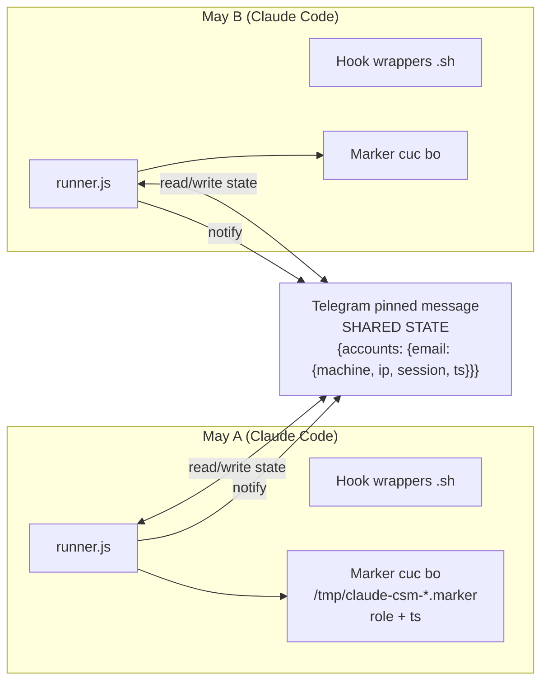
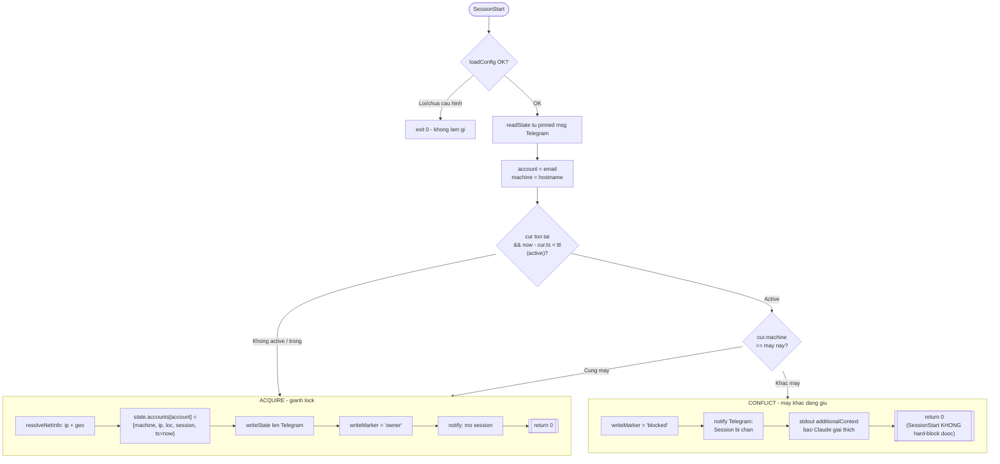
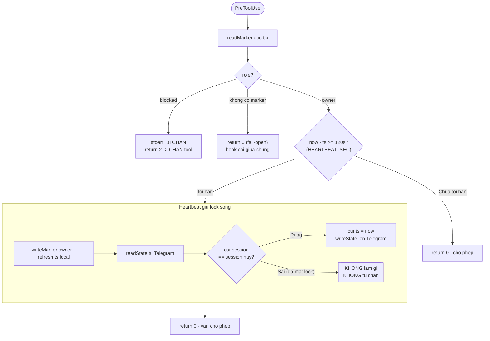
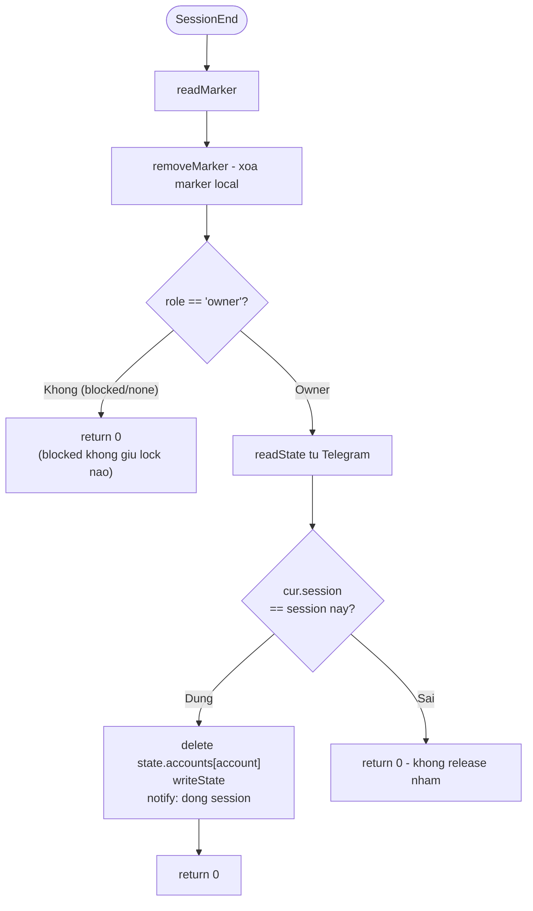
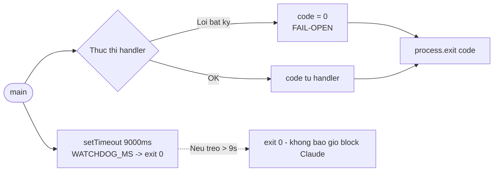

# claude-session-monitor — Luồng hoạt động hiện tại

> Nguồn: `src/hooks/runner.js` (runtime hook standalone) + `src/services/claudeSettings.js` (đăng ký hook).
> Cơ chế: account-lock cross-machine, dùng **pinned message trên Telegram** làm shared state store.
> Nguyên tắc: **FAIL-OPEN** — mọi lỗi config/network/parse → exit 0 (không bao giờ làm hỏng Claude), trừ `exit 2` cố ý khi session bị chặn.

## Các hằng số then chốt

| Hằng số | Giá trị | Ý nghĩa |
|---|---|---|
| `HEARTBEAT_SEC` | 120s | Cửa sổ gộp: refresh `exp` remote tối đa 1 lần/window, machine-wide (`.pushed`) |
| `ttl` | `= timeout` | Lấy thẳng `config.timeout` (bỏ floor). Dùng để tính `exp` và prune `ACTIVE_DIR` cục bộ |
| `NET_TIMEOUT_MS` | 6000ms | Timeout mỗi request mạng |
| `WATCHDOG_MS` | 9000ms | Cap tuyệt đối: nếu treo → exit 0 |

> `TTL_FLOOR_SEC` (600s) **không còn dùng trong logic** — thay bằng mô hình `exp` tuyệt đối (xem mục dưới). Hằng số còn giữ để tương thích.

Hook được đăng ký: **SessionStart**, **PreToolUse**, **SessionEnd** (không có `UserPromptSubmit`).

---

## Freshness theo `exp` tuyệt đối (holder tự khai hạn)

**Vấn đề cũ:** remote chỉ lưu `ts = now`, reader (máy B) so `now - ts < cfg.ttl` bằng **ttl của B**. Máy A timeout 3600, B timeout 600 → B tưởng A chết sau 10 phút → cướp lock sớm sai.

**Fix:** holder ghi **`exp = now + timeout`** (epoch **mili giây**) lên pin. Reader chỉ so **`Date.now() < cur.exp`** — hạn do HOLDER khai, không đụng config của reader.

- Entry remote tối giản: **`{machine, mid, exp}`** (account = key email).
- `active = Date.now() < cur.exp` (fallback `cur.ts` giây cho entry cũ).
- `liveConflict = active && !ours` → ⚠️ cảnh báo (read-only, không cướp).
- Holder **hết hạn** (`!active`) & khác máy → `staleHolder` → ♻️ tiếp quản.
- **Bỏ floor**: holder còn trong window luôn được bảo vệ; đổi lại holder crash phải chờ tới `exp` (last heartbeat + timeout) mới bị cướp — muốn cướp nhanh thì đặt `timeout` nhỏ.

**Refresh `exp` khi nhiều session live:** heartbeat (PreToolUse, mỗi session throttle 120s local) nhưng **push remote gộp machine-wide** qua `.pushed` — chỉ 1 session/120s ghi `editMessageText`, cả máy chung 1 `exp`. `ACTIVE_DIR` vẫn refresh per-session để đếm refcount chính xác.

---

## 1. Tổng quan kiến trúc

---

## 2. SessionStart — khi mở session

**Lỗ hổng (node B4):** SessionStart chỉ `return 0` (Claude Code không cho hook này hard-block).
→ Máy A vẫn gọi được model **turn đầu tiên** (và mọi turn thuần text) trước khi bị chặn ở PreToolUse → account bị dùng song song, khác IP → sai chính sách.

---

## 3. PreToolUse — chạy trước mỗi tool call

**Lỗ hổng (node R5):** nếu lock bị stale và máy khác cướp lock, owner cũ đọc thấy `cur.session != session mình` nhưng **không tự hạ xuống `blocked`** → 2 máy chạy song song, không máy nào bị chặn.

**Bản chất:** heartbeat đo **hoạt động qua tool call**, không đo **việc gọi model**. Turn thuần text tốn token nhưng không tạo heartbeat.

---

## 4. SessionEnd — khi đóng session

---

## 5. Watchdog & fail-safe (áp cho mọi event)

---

## Tổng hợp các vấn đề đã biết

| # | Vấn đề | Vị trí | Hệ quả |
|---|---|---|---|
| 1 | SessionStart không hard-block được | Sơ đồ 2, B4 | Turn đầu / text thuần vẫn gọi model → dùng song song khác IP |
| 2 | Owner mất lock không tự demote | Sơ đồ 3, R5 | Lock stale bị cướp → 2 máy chạy song song |
| 3 | Heartbeat đo tool call, không đo model call | onPreToolUse | Session tốn token nhưng lock tưởng im lặng → có thể stale |
| 4 | `editMessageText` không atomic | writeState | TOCTOU race **cross-machine** vẫn còn (cần store atomic). Race **cùng máy** đã hết: refcount ở `ACTIVE_DIR`, gate noti ở `OPEN_NOTICE`, remote entry `{machine,mid,exp}` idempotent |
| 5 | ~~Reader phán stale bằng ttl của chính nó~~ | ĐÃ FIX | Chuyển sang `exp` tuyệt đối holder khai; bỏ floor; `ttl = timeout` verbatim |

## Hướng khắc phục đề xuất

- Thêm hook **`UserPromptSubmit`** (fire trước khi prompt vào model, có thể `exit 2`) → chặn **trước** mọi model call → bịt vấn đề #1 và #3.
- `onPreToolUse` / `onUserPromptSubmit` của owner: khi đọc state thấy `cur.session != sessionId` → tự chuyển marker sang `blocked` + `return 2` → bịt #2.
- Chuyển **state/lock sang store atomic** (Redis `SET NX PX`, hoặc Firestore/Supabase transaction); Telegram chỉ giữ vai trò **notify** → bịt #4.
- Thống nhất default `timeout` giữa `init.js` và `config.js` → xử lý #5.
